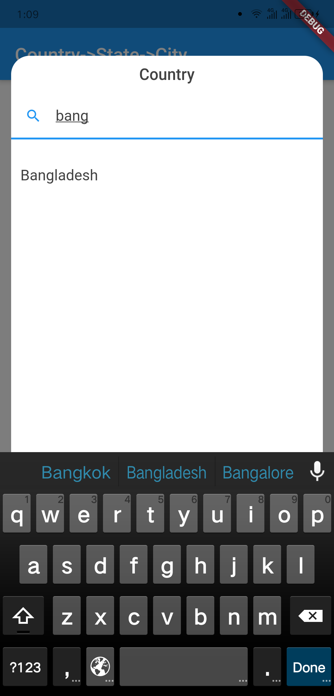
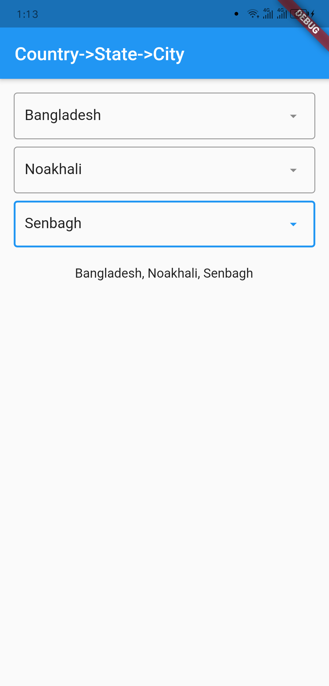

# country_state_city_pro

A new Flutter package to get world's all of Country, State, and City.
And items are also searchable. In addition if city can't be found then 
user manually write city on dialog window.

## Getting Started

### Platforms:
This widget has been successfully tested on iOS, Android and Chrome.

## Screenshots
Outlook                               | Country Dialog
--------------------------------------|--------------------------------------
 | 

Country Searching                     | State Dialog
--------------------------------------|--------------------------------------
 | 

City Dialog                           | Final Data
--------------------------------------|--------------------------------------
 | 

## Usage
```dart
import 'package:country_state_city/country_state_city_picker.dart';

///Define Controller
TextEditingController country=TextEditingController();
TextEditingController state=TextEditingController();
TextEditingController city=TextEditingController();

///Widget initialize
CountryStateCityPicker(
                country: country,
                state: state,
                city: city,
                textFieldInputBorder: UnderlineInputBorder(),
            ),
```

## Example Code
```dart
import 'package:flutter/material.dart';
import 'package:country_state_city/country_state_city_picker.dart';

void main() {
  runApp(MyApp());
}
class MyApp extends StatelessWidget {
  @override
  Widget build(BuildContext context) {
    return MaterialApp(
      title: 'Country->State->City',
      theme: ThemeData(
        primarySwatch: Colors.blue,
      ),
      home: HomePage(),
    );
  }
}

class HomePage extends StatefulWidget {
  @override
  _HomePageState createState() => _HomePageState();
}
class _HomePageState extends State<HomePage> {
  TextEditingController country=TextEditingController();
  TextEditingController state=TextEditingController();
  TextEditingController city=TextEditingController();
  @override
  Widget build(BuildContext context) {
    return Scaffold(
      appBar: AppBar(
        title: Text('Country->State->City'),
      ),
      body: Padding(
          padding: EdgeInsets.all(15.0),
          child: Column(
            children: [
              CountryStateCityPicker(
                country: country,
                state: state,
                city: city,
                textFieldInputBorder: UnderlineInputBorder(),
              ),
              SizedBox(height: 20),

              Text("${country.text}, ${state.text}, ${city.text}")
            ],
          )
      ),
    );
  }
}
```

## Connect with
<a href="mailto:sujitsarkar.cse@gmail.com">sujitsarkar.cse@gmail.com</a><br>
<a href="https://github.com/SujitSarkar">Find more project on github</a>
