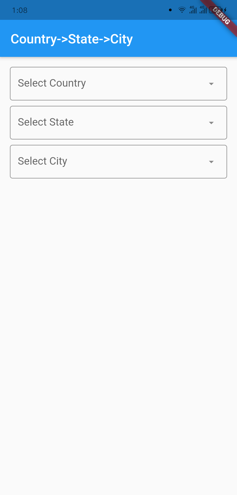
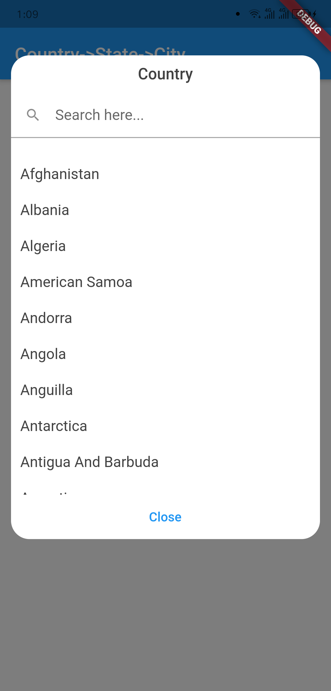
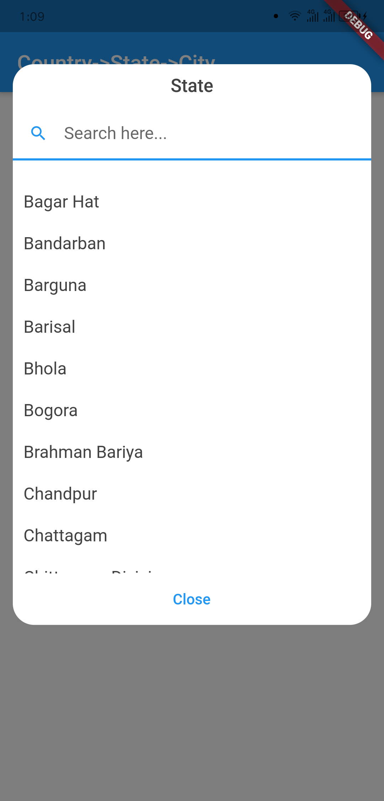
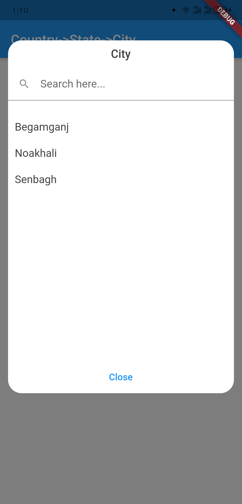

# country_state_city_pro

A new Flutter package to get world's all of Country, State, and City.
And items are also searchable. In addition if city can't be found then 
user manually write city on field.

## Getting Started

### Platforms:
This widget has been successfully tested on iOS, Android and Chrome.

## Screenshots







## Usage
```dart
CountryStateCityPicker(
                country: country,
                state: state,
                city: city,
                textFieldInputBorder: UnderlineInputBorder(),
            ),
```


